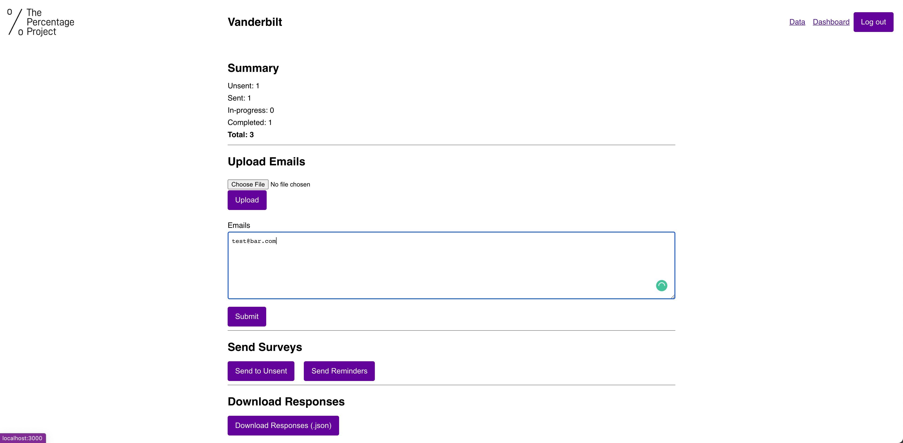
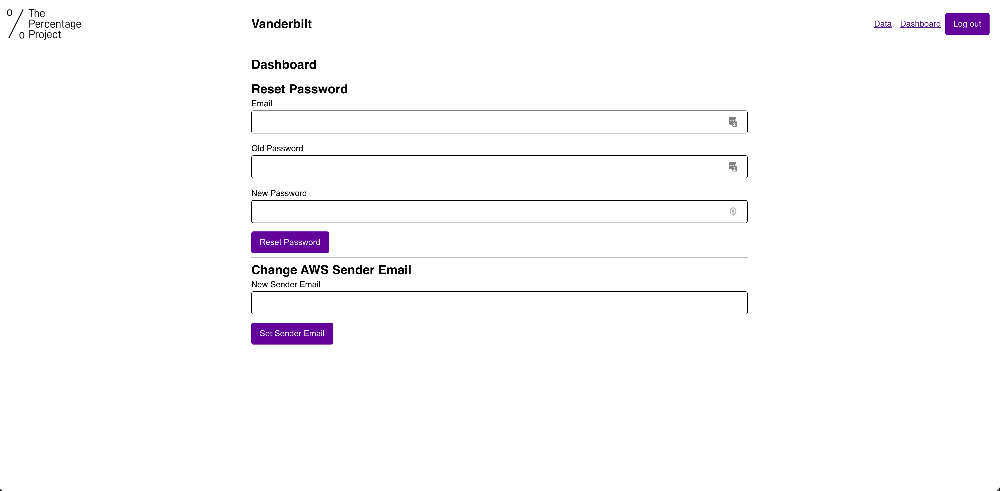
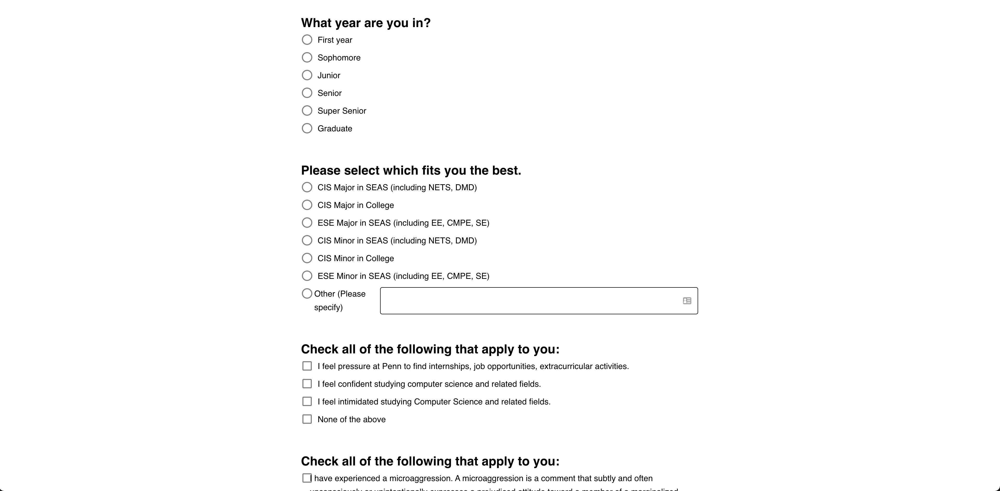

# anonymous-survey-engine

Built for the [Percentage Project](https://percentageproject.com/#/), this project allows survey responses unassociated from encrypted emails from different schools. Despite this, it also allows for sending reminder emails and supports basic analytics.

## Key Features
- Email
  - Encrypt emails from different schools
  - Send emails via Amazon SES
  - Send unique survey links associated with encrypted emails but not with responses
- School management
  - Upload emails and present summary statistics
  - Dispatch reminder emails
- % project admin
  - Manage school users
  - Download responses
- Survey
  - Customize surveys for schools
  - Allow for trigger warnings and hidden questions
- UI
  - Theme UI
  - React-toastify
- Tech stack
  - MongoDB
    - Mongoose
  - Express
    - Passport JWTs
  - React
  - Node
    - Session tokens
  - Amazon SES

### Screenshots
School admin panel

School dashboard

Mid-survey

## Quick Tour [under construction]
- The server is in `/server`, and the source files are in `/src`. 
  - Uses Mongoose to manage models to be stored.
- The client is bootstrapped from create-react-app, and is located in `/client`. 

## Getting Started
- From root, repeat:
### Client
`cd client`
`npm start`

### Server

- Generate an `.env` file in `./server` following the `.env.example` file.
- Start a `mongo` instance on your local machine, or use MongoDB Atlas and use the connection string from there.

`cd server`

- Get the latest schema into local (needed for production)
`npm run schema`

- Transpile the values in server
`npm run transpile`

- Start the server
`npm run watch:dev`

- Deploy to Heroku with monorepo support
`npm run heroku`

## Credits
The basic frame for the project and hooking up the Express server was inspired by https://github.com/CodingGarden/travel-log. 